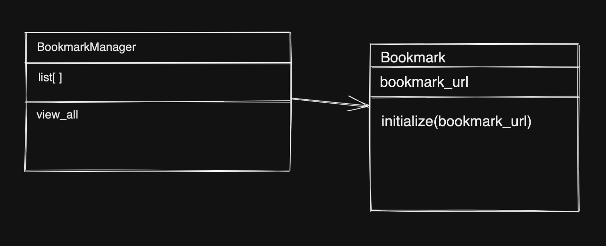
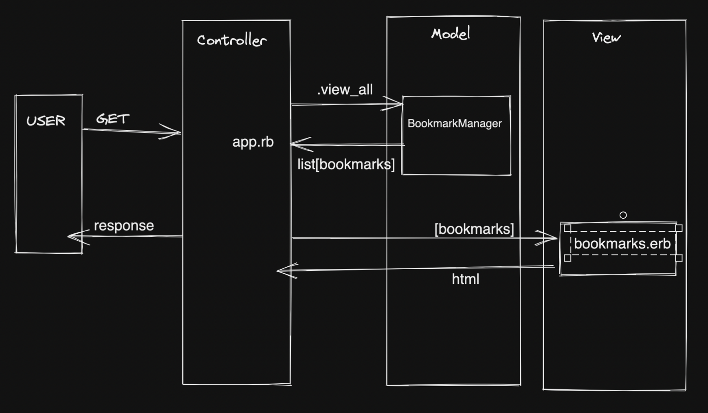

Show a list of bookmarks

## User Story 1:

As a user
So that I can revisit intersting web pages 
I want to view a list of saved bookmarks

| Verbs       | Nouns       |
| ----------- | ----------- |
| view        | bookmarks   |
|             | list        |

## User Story 2:
As a user
So I can remember my bookmarks
I want to add a bookmark to my saved bookmarks

On the client ....
user adds bookmark into a text box
user clicks submit button to save the bookmark
user then sees a refreshed list of bookmarks

there a post to controller using /create
the route /create adds a book mark to the database
the route redirects to /bookmarks
/bookmarks route calls bookmarks.erb
and the html is responded back to the client

psql Instructions
-----------------
* Type 'psql' into the command line
* Type 'CREATE DATABASE bookmark_manager;'
* Connect to the database with '\c bookmark_manager'
* Create a new table by typing 'CREATE TABLE bookmarks(id SERIAL PRIMARY KEY, url VARCHAR(60));'

## How to set up test database
Run the following commands within psql:
~~~~
$> psql
usernameadmin=# CREATE DATABASE "bookmark_manager_test";
username=# CREATE TABLE bookmarks(id SERIAL PRIMARY KEY, url VARCHAR(60));
~~~~